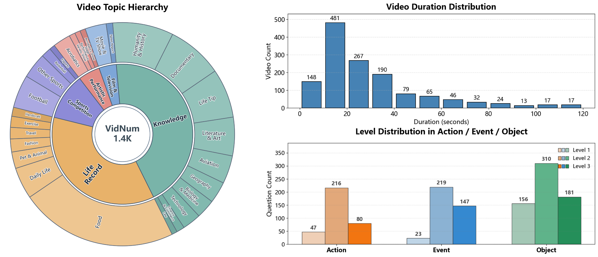

# VidNum-1.4K: A Comprehensive Benchmark for Video-based Numerical Reasoning

**Project Page:** https://VidNumTeam.github.io  



VidNum-1.4K is a benchmark for evaluating **video-based numerical reasoning** in Vision-Language Models (VLMs).

## Current Project Format 

This repository now uses a unified naming scheme for data and video mapping.

- Dataset file: `question_datasets/VidNum1_4K_options_en_category_en.xlsx`
- Question column: `question`
- Options columns: `option_A`, `option_B`, `option_C`, `option_D`
- Video files: stored in `videos/` as `QID_{ID}.mp4`


## Dataset Schema 

Minimum required columns:

- `ID`
- `question`
- `option_A`
- `option_B`
- `option_C`
- `option_D`

Common optional columns:

- `Answer`
- `Video_Path`
- `Level`
- `Reasoning_Type`
- `Count_Scope`

## Repository Structure

```text
.
├── question_datasets/          # benchmark tables (xlsx/jsonl)
├── videos/                     # full videos, named QID_{id}.mp4
├── datacuts/                   # optional clipped videos
├── run_VLM_evaluation/         # all run_*.py evaluation scripts
├── templates/                  # prompt templates
├── results/                    # model outputs
├── analysis_outputs/           # plots and analysis artifacts
├── videocut_multithread.py     # video utility pipeline
├── utils.py                    # shared data/schema helpers
├── ana_level_by_or_er.py
├── analyze_shotcut_accuracy_by_model.py
├── plot_vidnum14k_overview_panels.py
├── plot_intern_scale_level_curves.py
└── plot_cot_combined.py
```

## Evaluation Scripts

- All test/evaluation scripts are under `run_evaluation/` (current folder in this repo: `run_VLM_evaluation/`).
- If you want to rerun any evaluation script, download the benchmark assets first from Hugging Face:
  - https://huggingface.co/datasets/JoeyCCC/VidNum-1.4K

## Reproduce Paper Results

```bash
python ana_level_by_or_er.py
python ana_level_by_or_er.py
python plot_vidnum14k_overview_panels.py
python plot_intern_scale_level_curves.py
python plot_cot_combined.py
```
